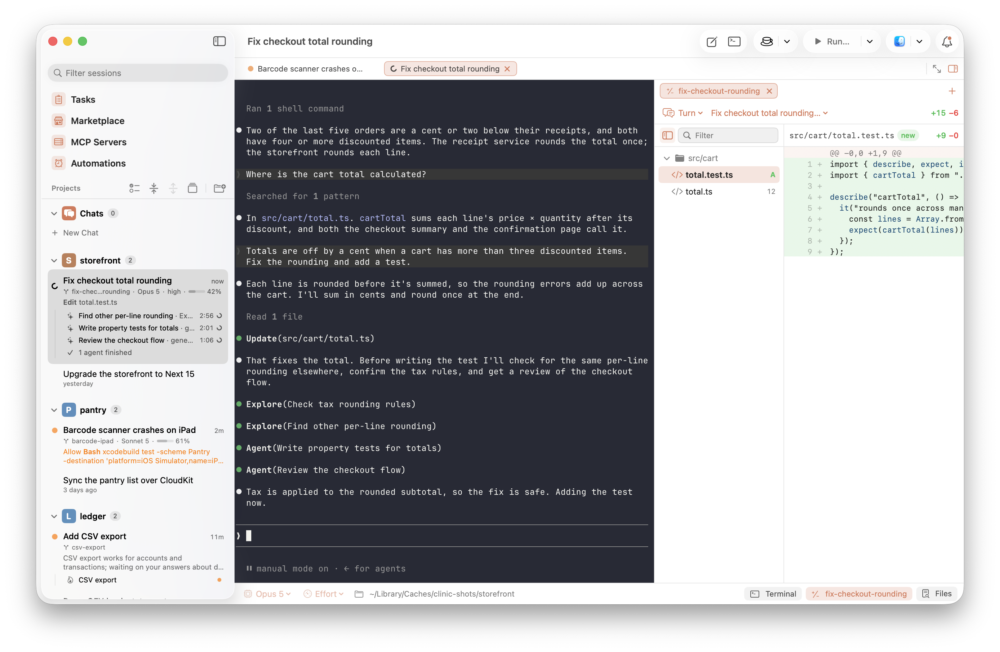

# Clinic

**All your Claude Code sessions, in good hands.**

See what every agent is doing, and know which one needs you, from one native Mac window.

<picture>
  <source media="(prefers-color-scheme: dark)" srcset=".github/assets/hero-dark.png">
  
</picture>

```sh
brew install --cask r0adkll/tap/clinic
```

## What you get

- **Every session in one sidebar.** Cards show each session's branch, model and context, and what it's doing right now.
- **Know when you're needed.** A notification and a waiting marker the moment an agent asks for permission or for your input.
- **The real `claude` CLI.** Unmodified, running in [Ghostty](https://ghostty.org) terminals that use your own Ghostty config.
- **Everything a session started, under it.** Subagents, background tasks, run configurations and pull requests, each with its status.
- **Diffs, files and pull requests** in a side panel beside the conversation.

Also: scheduled prompts with Automations, and sessions started straight from your GitHub issues with Tasks.

## Install

Apple Silicon, macOS 15 or later. Clinic runs the `claude` CLI, which must be on your `PATH`.

```sh
brew install --cask r0adkll/tap/clinic
```

Or download `Clinic-<version>.zip` from the [latest release](https://github.com/r0adkll/clinic/releases/latest). Builds are Developer ID-signed and notarized.

> Clinic is 0.x: used daily by its author, and its shape may still change between minor versions.

## Building

Requirements: macOS 15+, Xcode 26, Homebrew.

```sh
make setup        # installs xcodegen + zig@0.15, checks out the ghostty submodule
make ghostty      # builds GhosttyKit.xcframework from vendor/ghostty (one-time, several minutes)
make project      # generates Clinic.xcodeproj
make build        # builds the app
make test         # runs the test suites
make screenshots  # re-shoots the README and social preview images from staged sessions
```

Releasing: bump `MARKETING_VERSION` in `Version.xcconfig`, commit, then `make publish` — a guided flow that builds and notarizes, launches the app for a smoke test, drafts the notes, tags, creates the GitHub Release and updates the Homebrew cask. `make release` alone produces the notarized zip.

## Documentation

`docs/` is an Obsidian vault holding the design: an ADR per decision in `docs/Decisions/`, a one-page
summary in `docs/Design/Design Tree.md`, architecture and research notes, and a running log. It reads
fine as plain Markdown; open `docs/` as a vault if you want the wikilinks and graph.

## Credits

Clinic began as a clean-room macOS reimplementation of [Collins](https://github.com/episode6/collins), and has gone its own way since.

## License

MIT. Ghostty is MIT; its shell-integration scripts are GPLv3 and are not bundled.
